# ASAP Adapter 架构与技术文档

## 概述

ASAP (Air Shower Access Protocol) Adapter 是一个协议转换网关，核心职责是将**上层调度系统（RCS/WDCS）的业务指令**翻译为**底层风淋门硬件控制 + 区域管控**的 API 调用序列，并反向将设备状态上报给调度系统。

支持两种工作模式：
- **风淋门模式** (doorCode: 1001/1002)：通过 Angel 协议控制物理 AB 自动门
- **区域管控模式** (doorCode: q001/q002)：通过 Zone API 实现虚拟门的区域独占访问

---

## 系统架构

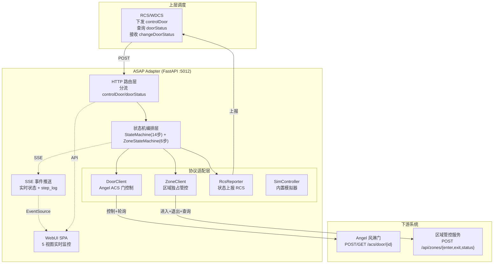

---

## 双模式分流

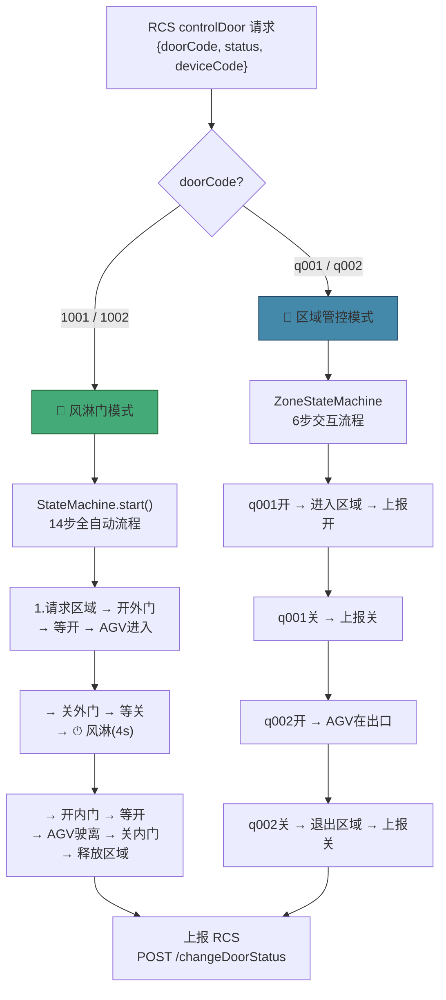

---

## 报文时序图

### 风淋门完整流程

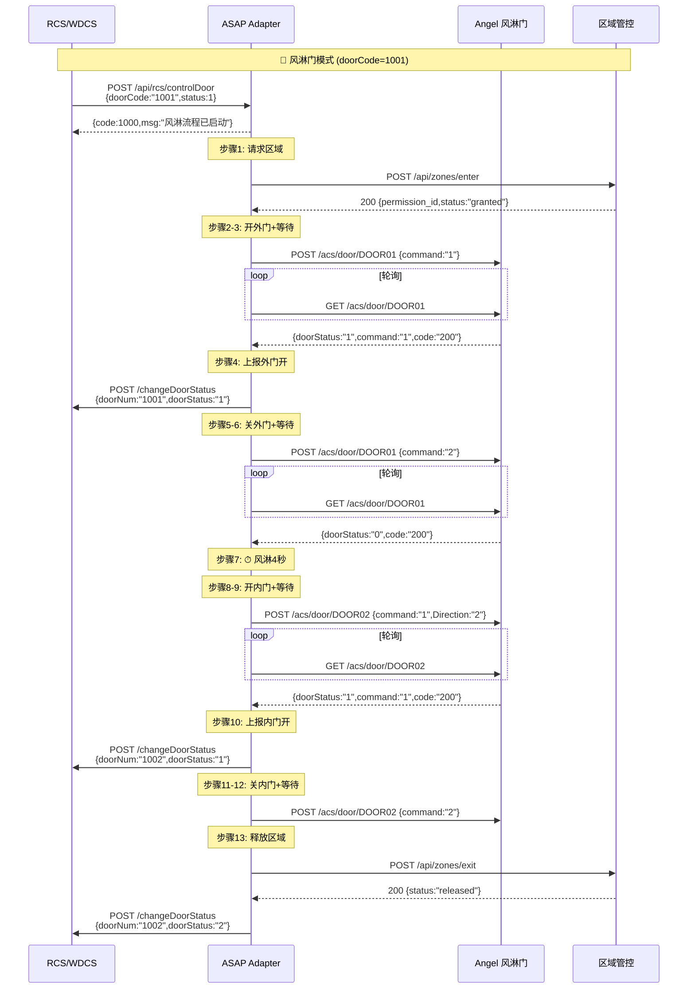

### 区域管控完整流程

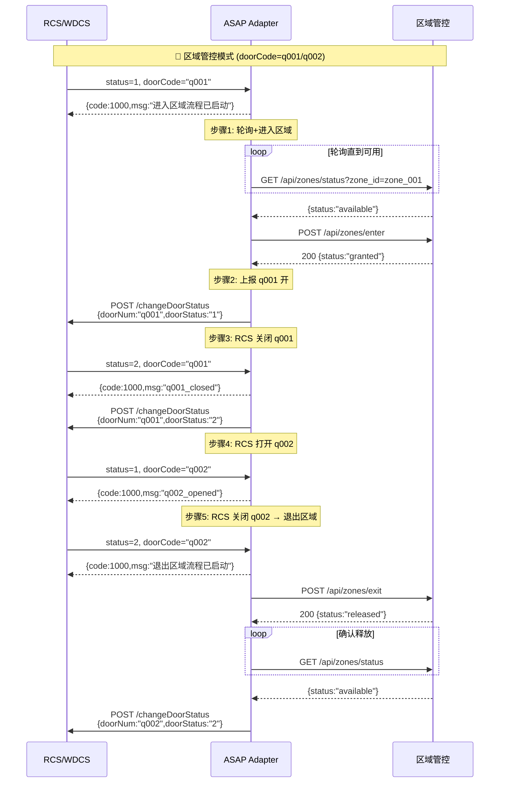

---

## 状态机设计

### 风淋门状态机 (`state_machine.py`)

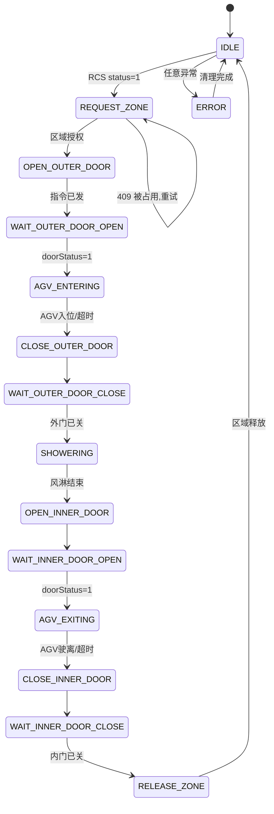

**14步对应关系：**

| 步骤 | 状态 | 动作 | 下游调用 |
|:---:|------|------|----------|
| 1 | REQUEST_ZONE | 请求区域 | POST /api/zones/enter |
| 2 | OPEN_OUTER_DOOR | 开外门 | POST /acs/door/{outer} command:1 |
| 3 | WAIT_OUTER_DOOR_OPEN | 等开门 | GET /acs/door/{outer} 轮询 |
| 4 | AGV_ENTERING | AGV进入 | 上报RCS 外门开 |
| 5 | CLOSE_OUTER_DOOR | 关外门 | POST /acs/door/{outer} command:2 |
| 6 | WAIT_OUTER_DOOR_CLOSE | 等关门 | GET /acs/door/{outer} 轮询 |
| 7 | SHOWERING | 风淋 | 内部计时 4s |
| 8 | OPEN_INNER_DOOR | 开内门 | POST /acs/door/{inner} command:1 |
| 9 | WAIT_INNER_DOOR_OPEN | 等开门 | GET /acs/door/{inner} 轮询 |
| 10 | AGV_EXITING | AGV驶离 | 上报RCS 内门开 |
| 11 | CLOSE_INNER_DOOR | 关内门 | POST /acs/door/{inner} command:2 |
| 12 | WAIT_INNER_DOOR_CLOSE | 等关门 | GET /acs/door/{inner} 轮询 |
| 13 | RELEASE_ZONE | 释放区域 | POST /api/zones/exit |

### 区域管控状态机 (`zone_state_machine.py`)

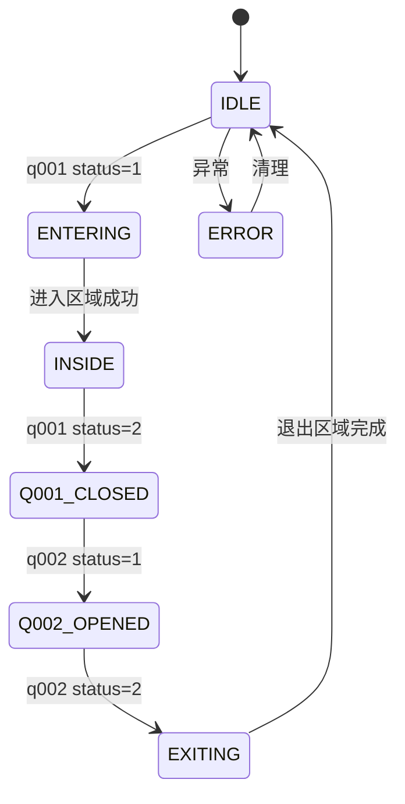

**6步对应关系：**

| 步骤 | 状态 | 触发 | 动作 |
|:---:|------|------|------|
| 1 | ENTERING | q001 status=1 | 轮询zone → POST enter |
| 2 | INSIDE | 进入成功 | 上报RCS q001开 |
| 3 | Q001_CLOSED | q001 status=2 | 上报RCS q001关 |
| 4 | Q002_OPENED | q002 status=1 | AGV在出口等待 |
| 5 | EXITING | q002 status=2 | POST exit → 轮询释放 |
| 6 | IDLE | 释放确认 | 上报RCS q002关 |

---

## 配置系统

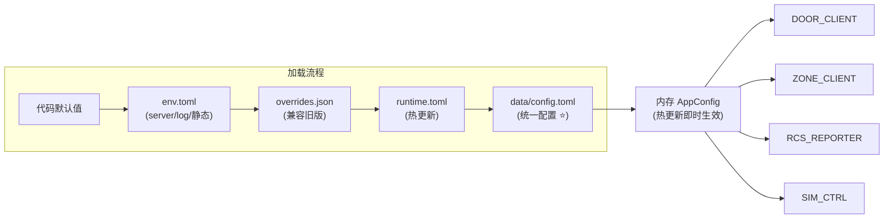

**统一配置文件 `data/config.toml`：**

```toml
# ASAP Adapter 统一配置
# 版本: 5 | 更新: 2026-06-13 20:11:xx

[angel]                          # AB 自动门对接
base_url = "http://10.68.2.10:5012/sim"
outer_door_id = "DOOR01"
inner_door_id = "DOOR02"
poll_interval = 1.0
poll_timeout = 30.0

[zone]                           # 区域管控对接
enter_url = "http://127.0.0.1:5012/sim/api/zones/enter"
exit_url = "http://127.0.0.1:5012/sim/api/zones/exit"
status_url = "http://127.0.0.1:5012/sim/api/zones/status"
zone_id = "zone_001"
entry_door_code = "q001"
exit_door_code = "q002"
zone_poll_interval = 300.0

[rcs]                            # RCS/WDCS 对接
change_status_url = "http://10.68.2.10:7110/changeDoorStatus"
report_interval = 0.5

[rcs.door_code_mapping]          # 门编码映射
DOOR01 = "1001"
DOOR02 = "1002"

[air_shower]                     # 风淋参数
duration = 4.0

[sim]                            # 内置模拟器
auto_open_delay = 2.0
auto_close_delay = 2.0
zone_always_busy = false
zone_id = "zone_001"

[meta]
version = 5
```

**特性：**
- 热更新：保存即生效，无需重启
- 版本号：每次保存自动 +1，备份旧文件
- 合并保存：只更新修改的字段，其他保留不变
- 可视化编辑：WebUI 配置管理页统一管理所有配置

---

## 门编码映射

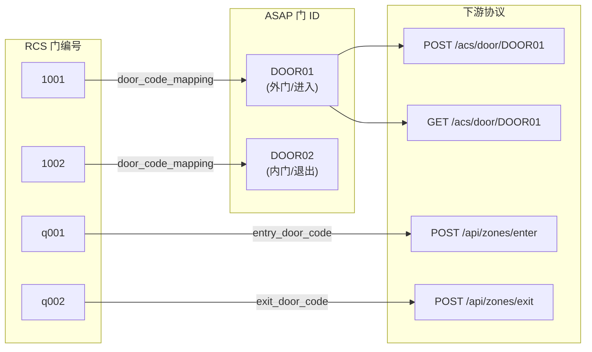

---

## 异常处理流程

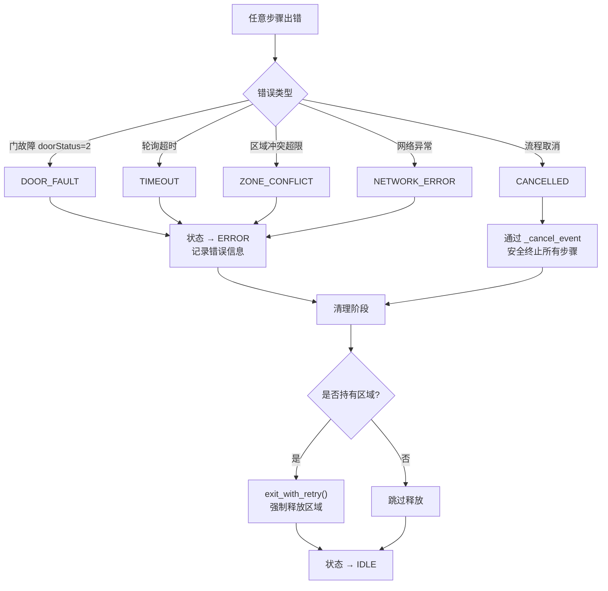

---

## 模块依赖

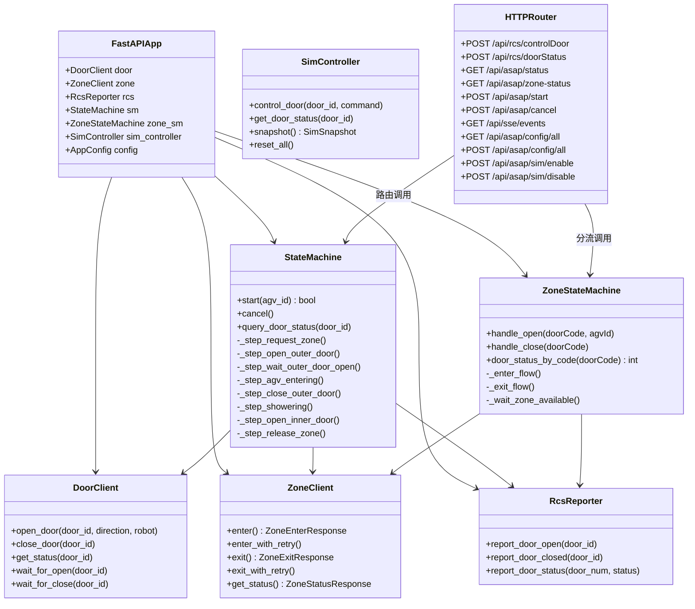

---

## WebUI 视图路由

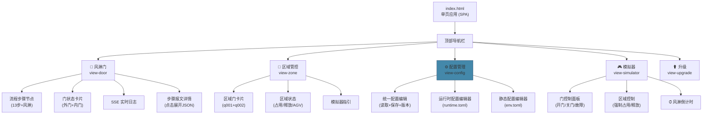

---

## 风淋时序甘特图

```mermaid
gantt
    title 风淋门流程时间线 (风淋4秒)
    dateFormat  X
    axisFormat %s秒

    section 外门
    请求区域           :a1, 0, 1
    开外门             :a2, after a1, 1
    等外门开(轮询)     :a3, after a2, 2
    AGV进入            :a4, after a3, 3
    关外门             :a5, after a4, 1
    等外门关(轮询)     :a6, after a5, 2

    section 风淋
    风淋计时           :b1, after a6, 4

    section 内门
    开内门             :c1, after b1, 1
    等内门开(轮询)     :c2, after c1, 2
    AGV驶离            :c3, after c2, 3
    关内门             :c4, after c3, 1
    等内门关(轮询)     :c5, after c4, 2
    释放区域           :c6, after c5, 1
```

---

## 报文映射总表

| 步骤 | RCS 输入 | ASAP 处理 | 下游调用 | 响应/RCS上报 |
|:---:|----------|-----------|----------|------------|
| 1 | `controlDoor {doorCode:"1001",status:1}` | 检测开门请求 | `POST /api/zones/enter` | 获得 permission_id |
| 2 | — | 区域授权通过 | `POST /acs/door/DOOR01 {command:"1",Direction:"1"}` | doorStatus: opening |
| 3 | — | 轮询等门全开 | `GET /acs/door/DOOR01` | doorStatus:"1",code:"200" |
| 4 | — | 门开→通知RCS | — | `POST /changeDoorStatus {doorNum:"1001",doorStatus:"1"}` |
| 5 | — | 超时后关外门 | `POST /acs/door/DOOR01 {command:"2"}` | |
| 6 | — | 轮询等门关 | `GET /acs/door/DOOR01` | doorStatus:"0" |
| 7 | — | ⏱ 风淋计时 4s | — | — |
| 8 | — | 开内门 | `POST /acs/door/DOOR02 {command:"1",Direction:"2"}` | |
| 9 | — | 轮询等门开 | `GET /acs/door/DOOR02` | doorStatus:"1" |
| 10 | — | 门开→通知RCS | — | `POST /changeDoorStatus {doorNum:"1002",doorStatus:"1"}` |
| 11 | — | 超时后关内门 | `POST /acs/door/DOOR02 {command:"2"}` | |
| 12 | — | 轮询等门关 | `GET /acs/door/DOOR02` | doorStatus:"0" |
| 13 | — | 释放区域 | `POST /api/zones/exit` | status:"released" |
| — | `controlDoor {status:2}` | 手动关门 | `POST /acs/door/{id} {command:"2"}` | |

---

## 实时更新机制

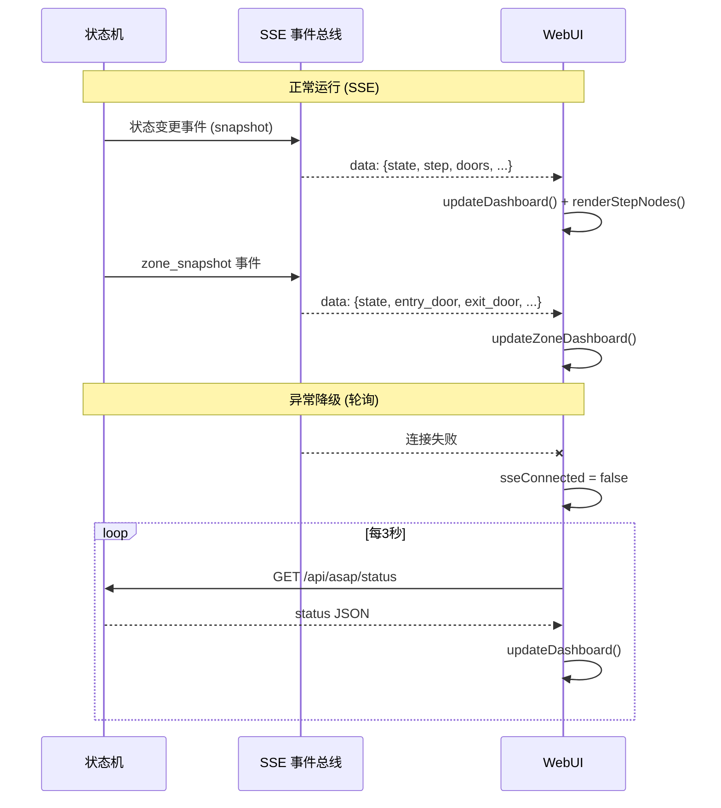

---

## 并发安全

- **单流程限制**：状态机一次只允许一个流程运行。`start()` 检查 `is_busy`。
- **异步非阻塞**：状态机在 `asyncio.Task` 中运行，不阻塞 HTTP 请求。
- **取消安全**：`_cancel_event` + `CancelledError` 安全终止所有步骤。
- **区域互斥**：通过 Zone API 独占式进入实现，同一时刻只有一辆车占用区域。
- **后台轮询**：区域状态 5 分钟定时轮询，进入/退出前后加速到 5 秒。

---

## 部署与升级

- **启动**：supervisor 管理，`python main.py` 或 `uvicorn`
- **端口**：5012 (API + WebUI + SSE + 模拟器)
- **配置**：`data/config.toml` 持久化，热更新即时生效
- **升级**：WebUI ZIP 上传 → 自动备份 → 解压覆盖 → 重启
- **日志**：`logs/asap.log`，5MB 轮转，保留 3 份
- **模拟器**：可选模块，`sim_controller/` 不存在时自动降级

---

## 版本历史

| 版本 | 主要变更 |
|------|----------|
| v1.x | 基础风淋门流程、区域管控对接 |
| v1.5.0 | 步骤流程节点可视化 + 报文详情 |
| v1.6.0 | 区域管控后台定时轮询 |
| v1.7.0 | ZoneStateMachine 独立状态机 (q001/q002) |
| v1.10.0 | 风淋倒计时 (默认4s) |
| v1.11.0 | q002 先开后关流程 + 报文明晰度 |
| v2.0.0 | 统一配置 data/config.toml + 版本管理 |
