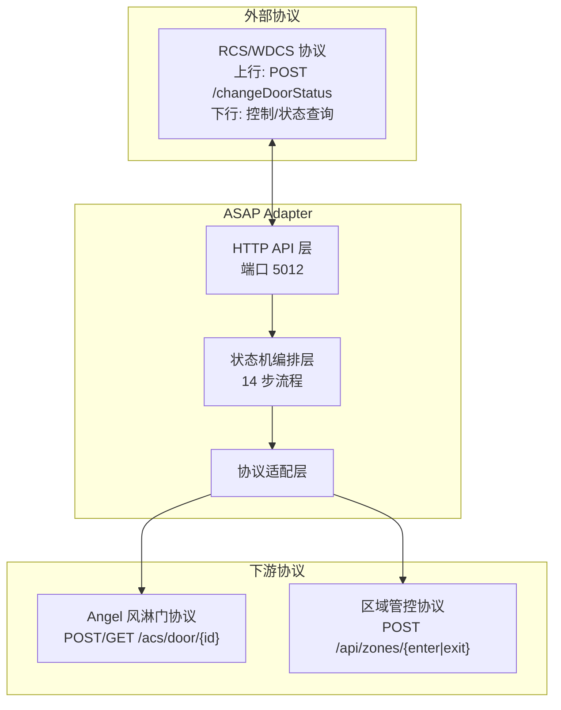
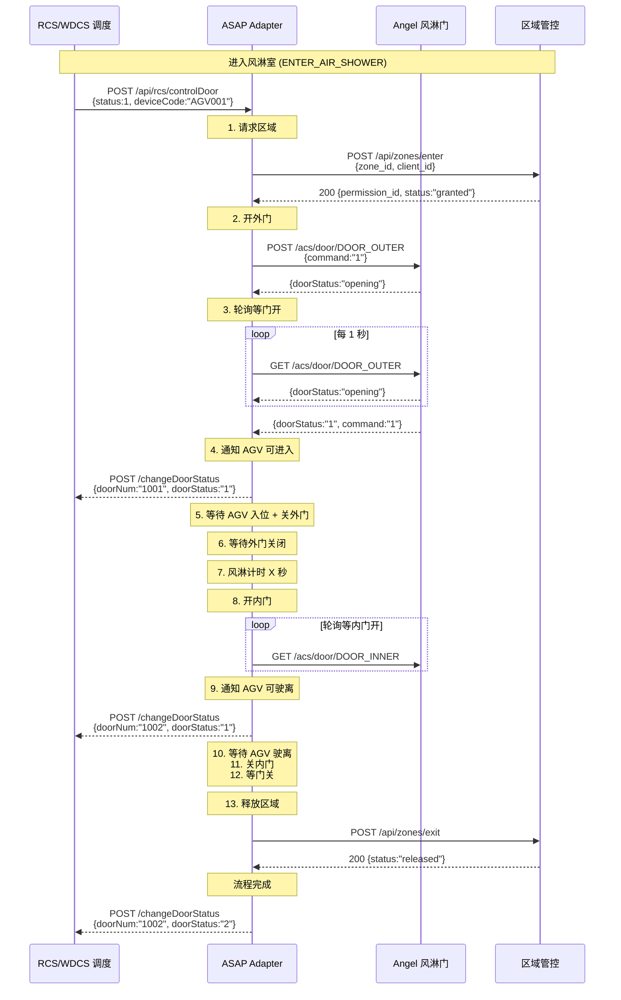
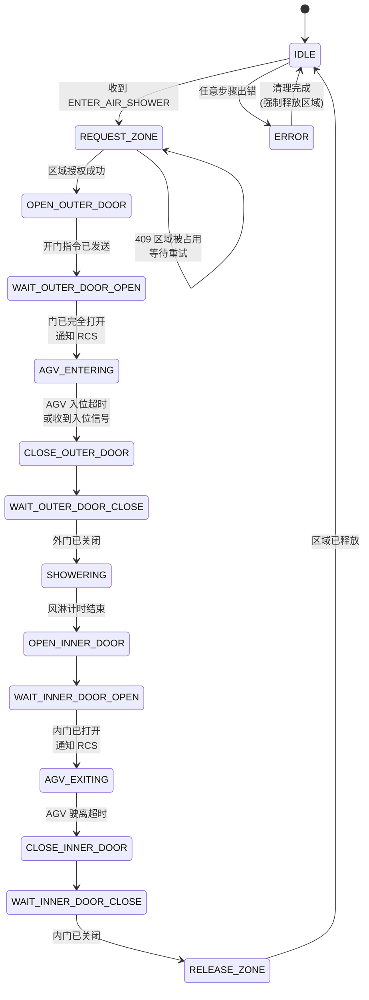
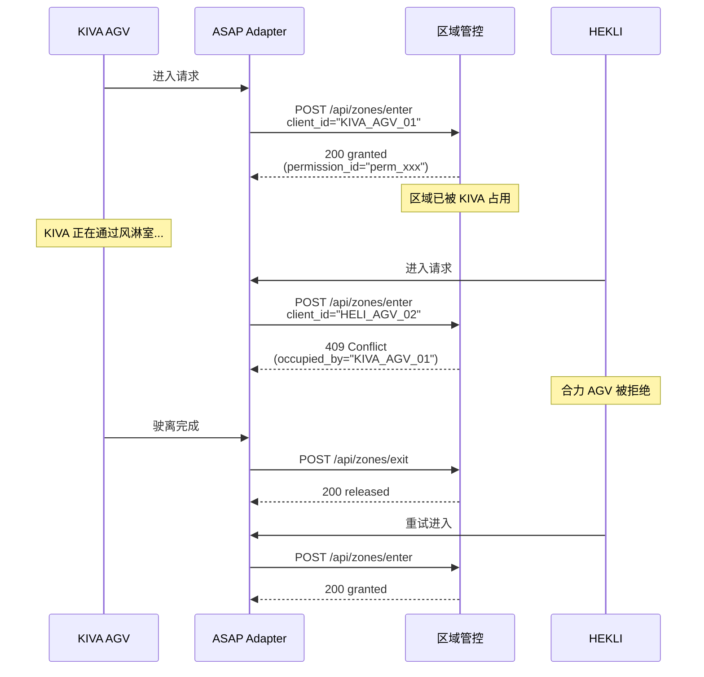
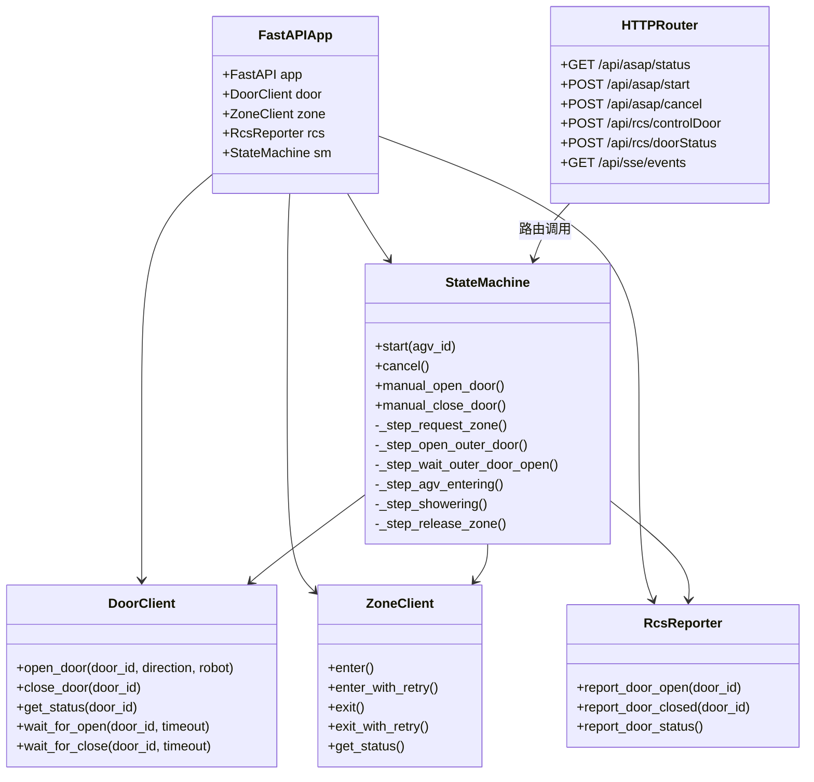

# ASAP Adapter 架构与技术文档

## 概述

ASAP (Air Shower Access Protocol) Adapter 是一个协议转换网关，核心职责是将**上层调度系统（RCS/WDCS）的业务指令**翻译为**底层风淋门硬件控制 + 区域管控**的 API 调用序列，并反向将设备状态上报给调度系统。

## 系统定位

```
┌─────────────────────────────────────────────────────────────────┐
│                      上层调度系统 (RCS/WDCS)                     │
│    下发开门指令 / 查询门状态 / 接收状态上报                      │
└──────────────────────────┬──────────────────────────────────────┘
                           │
                           ▼
┌─────────────────────────────────────────────────────────────────┐
│                      ASAP Adapter (端口 5012)                   │
│                                                                 │
│   ┌──────────┐  ┌─────────────┐  ┌───────────┐  ┌──────────┐   │
│   │ RCS 对接  │  │ 状态机编排   │  │ Angel协议  │  │ 区域管控  │   │
│   │ 接口层    │──│ 核心逻辑     │──│ 驱动层    │──│ 驱动层   │   │
│   └──────────┘  └─────────────┘  └───────────┘  └──────────┘   │
└─────────────────────────────────────────────────────────────────┘
                           │
          ┌────────────────┴────────────────┐
          ▼                                 ▼
┌────────────────────┐          ┌──────────────────────────┐
│  Angel 风淋门控制器  │          │  区域管控服务              │
│  协议: HTTP/POST    │          │  协议: HTTP POST/GET      │
│  /acs/door/{id}     │          │  /api/zones/enter/exit    │
│  GET状态/POST控制    │          │  独占式区域互斥            │
└────────────────────┘          └──────────────────────────┘
```

---

## 一、协议全景

ASAP Adapter 桥接三种协议：



| 协议 | 方向 | 报文格式 | 用途 |
|------|------|----------|------|
| **RCS/WDCS** | 双向 | HTTP JSON | 上层调度系统下发控制指令、查询状态、接收门状态上报 |
| **Angel** | 下行 | HTTP JSON (POST/GET) | 控制风淋门外门/内门开关、轮询门状态 |
| **区域管控** | 下行 | HTTP JSON (POST/GET) | 请求独占区域、释放区域、查询区域占用状态 |

---

## 二、报文转换流程

### 2.1 核心转换：单一指令 → 多步骤编排

ASAP 的核心能力是将上层的一个**业务指令**（如"进入风淋室"）拆解为对下游多个系统的**有序 API 调用序列**。



### 2.2 报文映射表

上层 RCS 指令 → ASAP 内部动作 → 下游 API 调用的完整映射：

| 步骤 | RCS 输入 | ASAP 处理 | 下游调用 | 响应转换 |
|------|----------|-----------|----------|----------|
| 1 | `status:1 (开门)` | 检测到开门请求，启动风淋流程 | `POST /api/zones/enter` | 将 `permission_id` 存入上下文 |
| 2 | - | 区域授权通过，开门 | `POST /acs/door/DOOR_OUTER {command:"1"}` | 将 `direction:"1"`、`robotName` 传入 |
| 3 | - | 循环直到 `command=="1" AND doorStatus=="1"` | `GET /acs/door/DOOR_OUTER` | 判断门是否完全打开 |
| 4 | - | 门开 → 通知 RCS | `POST /changeDoorStatus {doorStatus:"1"}` | 将 Angel 的 `1` 映射为 RCS 的 `"1"` |
| 5 | - | 超时后认为 AGV 已进入 | `POST /acs/door/DOOR_OUTER {command:"2"}` | - |
| 6 | - | 循环直到 `doorStatus=="0"` | `GET /acs/door/DOOR_OUTER` | 判断门是否关闭 |
| 7 | - | 内部延时 `duration` 秒 | 无 | - |
| 8 | - | 开内门 | `POST /acs/door/DOOR_INNER {command:"1"}` | - |
| 9 | - | 循环等内门全开 | `GET /acs/door/DOOR_INNER` | 判断 `command=="1" AND doorStatus=="1"` |
| 10 | - | 门开 → 通知 RCS | `POST /changeDoorStatus` | 映射门编号为 RCS doorCode |
| 11 | - | 超时后认为 AGV 已驶离 | `POST /acs/door/DOOR_INNER {command:"2"}` | - |
| 12 | - | 循环等内门关闭 | `GET /acs/door/DOOR_INNER` | 判断 `doorStatus=="0"` |
| 13 | - | 释放区域 | `POST /api/zones/exit` | 重试直到成功 |
| - | `status:2 (关门)` | 直接执行关门 | `POST /acs/door/DOOR_OUTER {command:"2"}` | - |

---

## 三、状态机设计

### 3.1 状态流转图



### 3.2 状态定义

| 状态 | 含义 | 执行动作 | 超时处理 |
|------|------|----------|----------|
| `IDLE` | 空闲，可接受新流程 | - | - |
| `REQUEST_ZONE` | 请求区域占用 | `POST /api/zones/enter`，409 时重试 | `max_retries` 次后失败 |
| `OPEN_OUTER_DOOR` | 开外门 | `POST /acs/door/DOOR_OUTER {command:"1"}` | - |
| `WAIT_OUTER_DOOR_OPEN` | 等外门打开 | 轮询 `GET /acs/door/DOOR_OUTER` | `poll_timeout` 秒 |
| `AGV_ENTERING` | 等待 AGV 进入 | 计时等待 / 等待 RCS 回调 | `agv_enter_timeout` 秒 |
| `CLOSE_OUTER_DOOR` | 关外门 | `POST /acs/door/DOOR_OUTER {command:"2"}` | - |
| `WAIT_OUTER_DOOR_CLOSE` | 等外门关闭 | 轮询门状态 | `poll_timeout` 秒 |
| `SHOWERING` | 风淋计时 | 内部等待 | `duration` 秒 |
| `OPEN_INNER_DOOR` | 开内门 | `POST /acs/door/DOOR_INNER {command:"1"}` | - |
| `WAIT_INNER_DOOR_OPEN` | 等内门打开 | 轮询门状态 | `poll_timeout` 秒 |
| `AGV_EXITING` | AGV 驶离 | 计时等待 | `agv_exit_timeout` 秒 |
| `CLOSE_INNER_DOOR` | 关内门 | `POST /acs/door/DOOR_INNER {command:"2"}` | - |
| `WAIT_INNER_DOOR_CLOSE` | 等内门关闭 | 轮询门状态 | `poll_timeout` 秒 |
| `RELEASE_ZONE` | 释放区域 | `POST /api/zones/exit`，失败重试 | `exit_max_retries` 次 |
| `ERROR` | 异常 | 强制释放区域 | 清理后自动回到 IDLE |

### 3.3 状态持久化

状态机运行在内存中，非持久化。异常或重启后状态丢失，回到 `IDLE`。这是设计上有意的选择——风淋流程本身是短生命周期操作（几十秒），且异常时安全策略是释放所有资源（门关闭、区域释放）。

---

## 四、三大协议适配层详解

### 4.1 Angel 风淋门适配 (door_client.py)

```
Angel 协议                         ASAP 内部模型
─────────────────                 ─────────────────
POST /acs/door/{id}               DoorClient.open_door(door_id, direction, robot)
  {doorSerial, command,            DoorClient.close_door(door_id)
   Direction, RobotName}
                                  ─────────────────
GET /acs/door/{id}                DoorClient.get_status(door_id)
 响应: {doorStatus, command,      DoorClient.wait_for_open(door_id, timeout)
       code}                      DoorClient.wait_for_close(door_id, timeout)
```

**关键转换逻辑：**

```
Angel doorStatus 值        →  ASAP 内部枚举
─────────────────────────     ────────────────
"0" (门已关闭)              →  AngelDoorStatus.CLOSED
"1" (门完全打开到位)        →  AngelDoorStatus.OPENED
"2" (故障)                 →  AngelDoorStatus.FAULT

AGV 驶离判断条件:
  Angel 响应中 command == "1" AND doorStatus == "1"
  → 转换为 "门已完全打开，AGV 可通行" 信号
```

**轮询机制：**
```
wait_for_open():
  loop:
    resp = GET /acs/door/{id}
    if resp.command == "1" AND resp.doorStatus == "1" → 成功返回
    if resp.doorStatus == "2" → 抛出 DoorFault 异常
    if resp.code == "500" → 抛出 DoorError 异常
    if 超时 → 抛出 Timeout 异常
    sleep poll_interval (默认 1 秒)
```

### 4.2 区域管控适配 (zone_client.py)

```
区域管控协议                         ASAP 内部模型
────────────────────                ─────────────────
POST /api/zones/enter              ZoneClient.enter()
  200 {permission_id, status}        → 成功，获得授权
  409 {error, occupied_by}           → 冲突，需重试

POST /api/zones/exit                ZoneClient.exit()
  200 {status: "released"}           → 释放成功

GET /api/zones/status               ZoneClient.get_status()
  200 {status, occupied_by}          → 查询结果
```

**带重试的进入逻辑：**
```
enter_with_retry():
  for attempt = 1 to max_retries:
    try:
      return enter()  ← POST /api/zones/enter
    catch ZoneClientError("被占用"):
      log_warn("区域被占用，第 N 次重试")
      sleep retry_interval
  throw "已达最大重试次数"
```

**带重试的退出逻辑（确保释放）：**
```
exit_with_retry():
  for attempt = 1 to exit_max_retries:
    try:
      return exit()  ← POST /api/zones/exit
    catch Exception:
      sleep exit_retry_interval
  throw "退出区域失败"
```

### 4.3 RCS/WDCS 对接适配 (rcs_reporter.py)

```
ASAP 内部状态变化                    RCS 报文
──────────────────                 ─────────────────
外门已打开                         POST /changeDoorStatus
  → report_door_open()              {doorNum: "1001", doorStatus: "1"}

外门已关闭                         POST /changeDoorStatus
  → report_door_closed()            {doorNum: "1001", doorStatus: "2"}

内门已打开                         POST /changeDoorStatus
  → report_door_open()              {doorNum: "1002", doorStatus: "1"}

内门已关闭                         POST /changeDoorStatus
  → report_door_closed()            {doorNum: "1002", doorStatus: "2"}
```

**门编码映射：**
```
ASAP door_id       →  RCS doorCode (配置在 env.toml)
─────────────────     ──────────────────────────
DOOR_OUTER         →  1001
DOOR_INNER         →  1002
```

**频率限制：**
```
report_door_status():
  if now - last_report_time < report_interval:  ← 默认 0.5 秒
    return  # 跳过，防止频繁上报
  POST /changeDoorStatus {doorNum, doorStatus}
```

---

## 五、异常处理策略

```mermaid
flowchart TD
    ANY[任意步骤出错] --> CHECK{错误类型}

    CHECK -->|门故障 doorStatus=2| DOOR_FAULT
    CHECK -->|门超时| TIMEOUT
    CHECK -->|区域冲突超限| ZONE_CONFLICT
    CHECK -->|网络错误| NETWORK
    CHECK -->|其他异常| OTHER

    DOOR_FAULT --> SET_ERROR["状态 → ERROR<br/>记录错误信息"]
    TIMEOUT --> SET_ERROR
    ZONE_CONFLICT --> SET_ERROR
    NETWORK --> SET_ERROR
    OTHER --> SET_ERROR

    SET_ERROR --> CLEANUP["清理阶段"]

    CLEANUP --> CHECK_ZONE{是否持有区域?}
    CHECK_ZONE -->|是| FORCE_RELEASE["exit_with_retry()<br/>强制释放区域"]
    CHECK_ZONE -->|否| SKIP_RELEASE["跳过"]

    FORCE_RELEASE --> DONE
    SKIP_RELEASE --> DONE

    DONE -->["状态 → IDLE<br/>等待下一次指令"]
```

| 异常场景 | 检测方式 | 处理动作 |
|----------|----------|----------|
| 门故障 | `doorStatus == "2"` 或 `code == "500"` | 立即停止流程，进入 ERROR |
| 门开关超时 | 轮询超过 `poll_timeout` | 抛出 Timeout，进入 ERROR |
| 区域被占用超限 | 重试超过 `max_retries` 次 | 停止重试，进入 ERROR |
| 区域释放失败 | 调用 `exit` 失败 | 在 ERROR 清理阶段重试 |
| 网络异常 | httpx 连接/读取超时 | 抛出 DoorClientError/ZoneClientError |
| AGV 超时未进入/驶离 | 超过配置的超时时间 | 自动进入下一步（认为已完成） |

---

## 六、安全与并发

### 6.1 区域互斥

AGV 交管的核心约束：
> 同一时刻只能有一辆车通过风淋室

实现方式：区域管控 API 的**独占式进入**机制：



### 6.2 并发安全

- **单流程限制**：状态机设计为单例模式，一次只允许一个风淋流程运行。`start()` 方法检查 `is_busy`，忙碌时拒绝新请求。
- **异步非阻塞**：状态机在 `asyncio.Task` 中运行，不会阻塞 HTTP 请求处理。
- **取消安全**：`cancel()` 方法通过 `asyncio.CancelledError` 和 `_cancel_event` 标志安全终止流程。

---

## 七、模块依赖关系



---

## 八、数据模型

### 8.1 Angel 协议模型

```
AngelControlRequest {
    doorSerial: str    // 门序列号
    command: str       // "0"无动作 "1"开 "2"关
    Direction: str?    // "1"进 "2"出
    RobotName: str?    // AGV 编号
}

AngelControlResponse / AngelStatusResponse {
    doorSerial: str    // 门序列号
    doorStatus: str    // "0"关 "1"开 "2"故障
    command: str       // 当前指令
    code: str          // "200"正常 "500"异常
}
```

### 8.2 区域管控模型

```
ZoneEnterRequest {
    zone_id: str       // 区域 ID
    client_id: str     // 请求方 ID
}

ZoneEnterResponse {
    permission_id: str // 授权 ID
    zone_id: str
    client_id: str
    status: str        // "granted"
}

ZoneExitRequest {
    zone_id: str
    client_id: str
}

ZoneExitResponse {
    zone_id: str
    client_id: str
    status: str        // "released"
}
```

### 8.3 RCS 对接模型

```
RcsDoorControlRequest {
    doorCode: str      // 门编号 (如 "1001")
    status: int        // 1=开门 2=关门
    deviceCode: str    // AGV 编号
    qrName: str        // 二维码
    orderId: int       // 任务 ID
    deviceNum: str     // AGV 设备号
    payLoad: str       // 负载重量
    thirdOrderId: str  // 第三方订单号
    entryPoint: str    // 入口节点
}

RcsDoorControlResponse {
    code: int          // 1000=成功
    msg: str
    data: null
}

RcsChangeStatusRequest {
    doorNum: str       // 门编号
    doorStatus: str    // "1"=开门 "2"=关门
}
```

---

## 九、配置驱动

所有外部依赖的地址和行为参数均可通过 `config/env.toml` 配置，无需修改代码：

```
┌──────────────────────────────────────────┐
│              env.toml                     │
├──────────────────────────────────────────┤
│ [angel]                                   │
│ base_url       = "http://192.168.1.100"   │ ← 风淋门地址
│ poll_interval  = 1.0                      │ ← 轮询频率
│ poll_timeout   = 30.0                     │ ← 轮询超时
│                                           │
│ [zone]                                    │
│ enter_url      = "http://zone-api/enter"  │ ← 区域进入 API
│ max_retries    = 10                       │ ← 冲突重试次数
│                                           │
│ [air_shower]                              │
│ duration       = 15.0                     │ ← 风淋时长
│                                           │
│ [rcs]                                     │
│ change_status_url = "http://rcs/..."      │ ← RCS 上报地址
│ door_code_mapping = {DOOR_OUTER="1001"}   │ ← 门编码映射
└──────────────────────────────────────────┘
```

支持运行时热更新，通过 WebUI 底部的 RCS 配置面板修改后自动持久化到 `config/overrides.json`，重启后保留。

**覆盖优先级：** `overrides.json` > `env.toml` > 代码默认值

---

## 十、与 cross_env_manager 架构对比

| 维度 | cross_env_manager (参考项目) | ASAP Adapter |
|------|---------------------------|--------------|
| 框架 | Flask + Jinja2 模板 | FastAPI + 静态 SPA |
| 协议对接 | 单一系统内部管理 | 三方协议桥接网关 |
| 状态管理 | 数据库持久化 | 内存异步状态机 |
| 核心模式 | CRUD + 日志查看 | 流程编排 + 协议翻译 |
| 部署结构 | 单体应用 | 单体 + 独立模拟器 |
| 升级机制 | 同 (ZIP 上传备份回滚) | 同 (代码复用) |
| 异步 | 同步 (Flask + WSGI) | 异步 (FastAPI + ASGI) |
