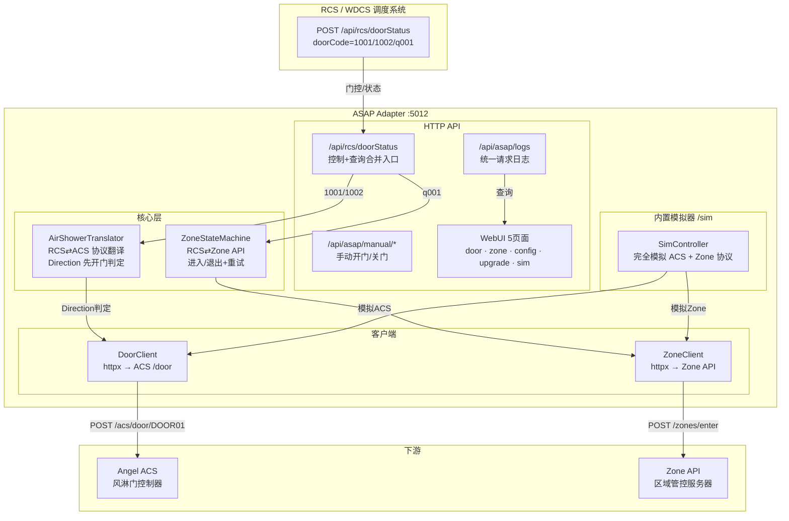
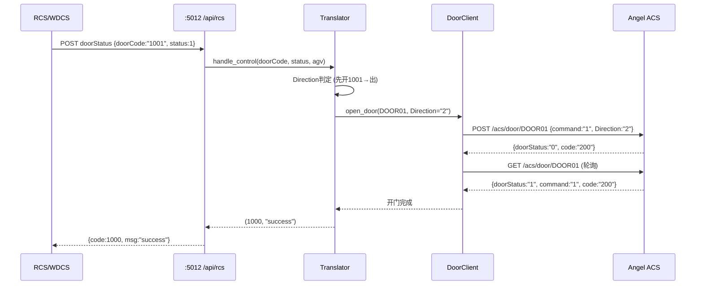

# ASAP Adapter v3.3

**Air Shower Access Protocol Adapter** · 风淋门-区域管控协议适配器

> 纯协议翻译层 — RCS 门控 ↔ Angel ACS 风淋门 + Zone API 区域管控。无状态机，无风淋计时，单向翻译。

---

## 架构



### 核心设计原则

| 原则 | 说明 |
|:---|:---|
| **纯协议翻译** | RCS 发什么 → 翻译 → 发 ACS/Zone → 响应翻译 → 回 RCS。无状态机编排 |
| **Direction 先开判定** | 两门全关时，先开哪扇决定 Direction（1001→出, 1002→进）。持续到两门再全关才重置 |
| **阻塞式控制** | 开门/关门请求阻塞等待 ACS 返回 `doorStatus="1"/"0"` 后再响应 RCS |
| **区域预检** | 进入区域前查询占用状态：同 AGV→直接开，其他→拒绝（2001） |
| **轮询日志** | 前端 POST 轮询 `/api/asap/logs`，替代 SSE 推送 |

---

## 项目结构

```
ASAP_Adapter/
├── asap_adapter/                   # 核心包
│   ├── __init__.py                 # __version__ = "3.3.0"
│   ├── main.py                     # FastAPI 入口 + 生命周期 + 后台轮询
│   ├── config.py                   # TOML 配置加载 (多优先级)
│   ├── models.py                   # Pydantic 数据模型 (RCS/Angel/Zone 协议)
│   ├── door_client.py              # Angel 风淋门 HTTP 客户端 (httpx)
│   ├── door_translator.py          # 协议翻译器 (RCS⇄ACS + Direction)
│   ├── zone_client.py              # 区域管控 HTTP 客户端
│   ├── zone_state_machine.py       # 区域管控状态机 (q001→enter/exit)
│   ├── router.py                   # HTTP API 路由 (全部端点)
│   ├── logger.py                   # 日志配置 (文件轮转)
│   ├── upgrade_service.py          # ZIP 包升级管理 (备份/回滚)
│   └── static/
│       ├── common.js               # 公共脚本 (主题/JSON高亮/日志渲染/轮询)
│       ├── common.css              # 公共样式 (Glassmorphism)
│       ├── index.html              # 风淋门页面
│       ├── zone.html               # 区域管控页面
│       ├── config.html             # 配置管理页面
│       └── upgrade.html            # 升级管理页面
├── sim_controller/                 # 内置模拟器 (挂载到 /sim)
│   ├── state.py                    # 模拟状态管理 (门+区域)
│   ├── models.py                   # 模拟器 Pydantic 模型
│   ├── router.py                   # 模拟器 API 路由
│   └── static/index.html           # 模拟器 WebUI
├── config/
│   ├── env.toml                    # 静态配置 (gitignore)
│   ├── env.template.toml           # 配置模板
│   ├── runtime.toml                # 运行时配置 (注释模板)
│   └── old/                        # 配置备份
├── data/
│   └── config.toml                 # 统一运行时配置 (WebUI 可视化编辑)
├── doc/
│   ├── ACSangel.md                 # Angel 风淋门协议
│   ├── rcswdcs.md                  # RCS/WDCS 对接协议
│   ├── 风淋门逻辑梳理.md
│   └── 区域管控逻辑梳理.md
├── deploy_iraypleos/               # CentOS 7 离线部署
├── test/                           # 测试脚本 (gitignore)
├── logs/                           # 运行时日志 (gitignore)
├── venv/                           # 虚拟环境 (gitignore)
└── backup/                         # 升级备份 (gitignore)
```

---

## 数据流



---

## API 端点

### RCS 对接

| 端点 | 方法 | 用途 |
|:---|:---|:---|
| `/api/rcs/doorStatus` | POST | 门状态查询 + 控制（单一入口） |
| `/api/rcs/controlDoor` | POST | [兼容] 同 doorStatus |
| `/actuator/health` | GET | 健康检查 → `1000` |

### ASAP 管理

| 端点 | 方法 | 用途 |
|:---|:---|:---|
| `/api/asap/logs` | GET | 统一请求日志 (`?source=rcs\|zone\|all&limit=50`) |
| `/api/asap/status` | GET | 风淋系统整体状态快照 |
| `/api/asap/zone-status` | GET | 区域管控状态 (实时查询) |
| `/api/asap/manual/open` | POST | 手动开门 (`?door_id=DOOR01`) |
| `/api/asap/manual/close` | POST | 手动关门 |
| `/api/asap/zone/force-door` | POST | 强制设置区域门状态 |
| `/api/asap/refresh-doors` | POST | 主动刷新双门状态 |

### 配置管理

| 端点 | 方法 | 用途 |
|:---|:---|:---|
| `/api/asap/config/all` | GET/POST | 统一配置 (data/config.toml) |
| `/api/asap/config/runtime` | GET/POST | 运行时配置编辑 |
| `/api/asap/config/env` | GET/POST | 静态配置编辑 (需重启) |
| `/api/asap/config/zone` | GET/POST | 区域配置 |
| `/api/asap/config/angel` | GET/POST | Angel 门配置 |
| `/api/asap/config/rcs` | GET/POST | RCS 配置 |
| `/api/asap/config/sim` | GET/POST | 模拟器配置 |

### 模拟器控制

| 端点 | 方法 | 用途 |
|:---|:---|:---|
| `/api/asap/sim/enable` | POST | 启用模拟器 (重定向 Door/Zone) |
| `/api/asap/sim/disable` | POST | 关闭模拟器 (恢复生产配置) |
| `/api/asap/sim/status` | GET | 模拟器状态 |

### 升级管理

| 端点 | 方法 | 用途 |
|:---|:---|:---|
| `/api/asap/upgrade/version` | GET | 当前版本信息 |
| `/api/asap/upgrade/records` | GET | 升级记录 |
| `/api/asap/upgrade/upload` | POST | 上传 ZIP 升级包 |
| `/api/asap/upgrade/rollback/{name}` | POST | 回滚到指定备份 |

### 内置模拟器 `/sim`

| 端点 | 方法 | 用途 |
|:---|:---|:---|
| `/acs/door/{door_id}` | POST/GET | 模拟 Angel 风淋门协议 |
| `/api/zones/enter` | POST | 模拟区域进入 |
| `/api/zones/exit` | POST | 模拟区域退出 |
| `/api/zones/status` | GET | 模拟区域状态查询 |
| `/api/sim/status` | GET | 模拟器完整快照 |
| `/api/sim/door/set` | POST | 手动设置门状态 |
| `/api/sim/door/fault` | POST | 注入门故障 |
| `/api/sim/zone/busy` | POST | 强制区域占用 |
| `/api/sim/config/delays` | POST | 设置门过渡延时 |
| `/api/sim/reset` | POST | 重置模拟器 |

---

## 配置说明

### 配置优先级

```
data/config.toml > dataclass 默认值
```

首次启动时 `/data/config.toml` 自动从模板生成，无需手动创建。

### env.toml (系统配置，修改需重启)

| 段 | 键 | 默认值 | 说明 |
|:---|:---|:---|:---|
| `server` | `port` | `5012` | 服务端口 |
| `server` | `host` | `0.0.0.0` | 监听地址 |
| `log` | `level` | `INFO` | 日志级别 |
| `log` | `file` | `logs/asap.log` | 日志文件 |

### data/config.toml (业务配置，即时生效)

WebUI 配置页 `/config` 可可视化编辑。也可直接修改 TOML 文件。

| 段 | 键 | 默认值 | 说明 |
|:---|:---|:---|:---|
| `angel` | `base_url` | `http://127.0.0.1:5012/sim` | 风淋门地址 |
| `angel` | `outer_door_id` | `DOOR01` | 外门 ID |
| `angel` | `inner_door_id` | `DOOR02` | 内门 ID |
| `angel` | `poll_timeout` | `30.0` | 轮询超时 (秒) |
| `zone` | `enter_url` | `http://127.0.0.1:5012/sim/api/zones/enter` | 区域进入 |
| `zone` | `exit_url` | `http://127.0.0.1:5012/sim/api/zones/exit` | 区域退出 |
| `zone` | `status_url` | `http://127.0.0.1:5012/sim/api/zones/status` | 区域状态 |
| `zone` | `zone_id` | `zone_001` | 区域 ID |
| `zone` | `entry_door_code` | `q001` | 区域门 RCS 编码 |
| `zone` | `zone_poll_interval` | `300.0` | 区域状态轮询间隔 (秒) |
| `zone` | `exit_max_retries` | `30` | 退出重试次数 |
| `rcs` | `change_status_url` | - | RCS 状态上报地址 |
| `rcs` | `door_code_mapping` | `{DOOR01="1001", DOOR02="1002"}` | 门编码映射 |
| `sim` | `zone_id` | `zone_001` | 模拟器区域 ID |
| `sim` | `auto_open_delay` | `2.0` | 门开过渡延时 |

---

## 内置模拟器

模拟器挂载在 ASAP 主端口 `/sim` 路由下，通过 WebUI **启用模拟器** 即可将 Door/Zone 客户端重定向到本地模拟端点，无需启动独立进程。

```bash
# 启动 ASAP (含内置模拟器)
python3 -m asap_adapter.main

# WebUI
http://localhost:5012/          # 风淋门
http://localhost:5012/sim       # 模拟器
http://localhost:5012/zone      # 区域管控
http://localhost:5012/config    # 配置
http://localhost:5012/upgrade   # 升级
```

### 模拟器 WebUI 功能

| 功能 | 说明 |
|:---|:---|
| **门状态面板** | 实时显示 DOOR01/DOOR02 状态，支持开门/关门/故障注入 |
| **区域管控面板** | 区域占用状态，强制占用/释放，始终繁忙模式 |
| **模拟配置** | 调整开门/关门过渡延时 |
| **快速测试** | 一键模拟风淋流程 / 区域冲突 / 门故障 |
| **请求日志** | 所有 API 请求记录，点击展开 JSON 报文 (语法高亮) |

---

## RCS 第三方对接

在 RCS/WDCS 数据库 `access_config` 表中配置：

| 配置项 | 值 |
|:---|:---|
| `control_way` | `4` |
| `door_control_relation_id` | `http://<HOST>:5012/api/rcs/doorStatus` |
| `door_status_relation_id` | `http://<HOST>:5012/api/rcs/doorStatus` |
| `door_type` | `2` |
| `door_has_status` | `true` |
| 门编号 | `1001` (外门) / `1002` (内门) / `q001` (区域门) |

---

## 升级管理

支持 POST ZIP 包在线升级，自动备份当前代码，可回滚。

### 制作升级包

```bash
# 项目根目录打包
zip -r d.zip asap_adapter/*.py asap_adapter/static/ sim_controller/

# 放入 version.json
echo '{"title":"v3.3.4 修复xxx"}' > version.json
zip d.zip version.json && rm version.json
```

### 上传

```bash
curl -X POST http://HOST:5012/api/asap/upgrade/upload \
  -F "file=@d.zip" -F "remark=xxx"
```

### 排除保护

升级时自动保留：`config/env.toml`, `venv/`, `logs/`, `backup/`, `test/`, `.git/`, `.gitignore`, `skill.md`, `README.md`

---

## 离线部署

参见 `deploy_iraypleos/` — CentOS 7 / openEuler Python 3.9 离线环境自动部署脚本。
